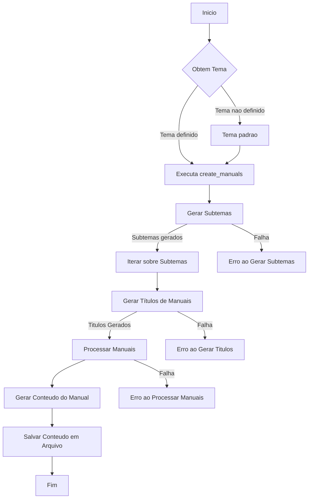

# 📚 Doc Generator AI 🚀


## 🌟 Visão Geral

O **Doc Generator AI** é uma aplicação avançada que automatiza a geração de manuais técnicos detalhados utilizando inteligência artificial. Todos os manuais presentes nesse repositório foram gerados on cloud usando arquitetura de cloud nativa, prática de CD e remote reployment e remote execution para geração dos artefatos usando Github Actions. Todo código nesse repositório foi gerado de forma 100 % automática usando a Ia do google Gemini em ambiente cloud do proprio github actions. Este projeto faz parte do meu portfólio pessoal de DevOps e exemplifica a implementação completa do ciclo CI/CD e automação de DevOps, integrado com soluções de IA.

Este projeto demonstra um exemplo prático de automação de CI/CD para geração de documentação usando GitHub Actions, destacando minha habilidade em desenvolvimento de automação, integração contínua e entrega contínua (CI/CD), e uso de ferramentas de automação para melhorar eficiência e consistência no ciclo de desenvolvimento de software.

<!-- 🤖📚 Repositório de Automação de Documentação de IA e Python -->

Este repositório exemplifica a automação de documentação para projetos de IA e Python, integrando práticas avançadas de CI/CD e DevOps. Utiliza GitHub Actions para gerar documentação automaticamente a partir do código fonte.





### Comentários sobre o Código

- **Objetivo Geral**: O script foi projetado para automatizar a criação de manuais a partir de um tema central, utilizando uma API de geração de conteúdo. A lógica permite gerar subtemas, títulos de manuais e, finalmente, o conteúdo de cada manual.
- **Uso de Funções Específicas**:
  - `generate_unique_name()`: Cria um nome único para o manual baseado em uma hash SHA-256 do texto.
  - `generate_content()`: Faz uma requisição à API para gerar o conteúdo.
  - `generate_subthemes()`: Gera subtemas a partir de um tema principal.
  - `generate_manual_titles()`: Gera títulos de manuais para cada subtema.
  - `process_manuals()`: Processa os manuais em paralelo para melhorar o desempenho usando `ThreadPoolExecutor`.
  - `generate_manual_content()`: Gera o conteúdo de cada manual, seguindo um formato detalhado e estilizado.
  - `create_manuals()`: Função principal que coordena todas as etapas de geração de manuais.

Este diagrama ajuda a visualizar o fluxo do script e entender como as diferentes partes do código interagem para atingir o objetivo final de criar manuais estilizados.

# 📝 **Projeto: Gerador de Manuais de Conteúdo Automatizado** 🚀

Este projeto tem como objetivo criar manuais de conteúdo detalhados e estilizados com base em temas específicos, utilizando uma **API de geração de conteúdo**. O código é escrito em Python e faz uso de várias bibliotecas para manipulação de dados, requisições HTTP, processamento em paralelo e geração de hashes únicas.

## 🌟 **Principais Funcionalidades**

1. **Geração de Nomes Únicos** 🔑  
   A função `generate_unique_name` cria um identificador único para cada manual gerado. Utiliza a biblioteca `hashlib` para gerar uma **hash SHA-256** baseada no texto do prompt, garantindo que cada manual tenha um nome exclusivo.

    ```python
    def generate_unique_name(prompt_text):
        # Remove caracteres especiais e espaços
        clean_text = re.sub(r'[^\w\s]', '', prompt_text)
        hash_object = hashlib.sha256(clean_text.encode())
        hash_digest = hash_object.hexdigest()
        unique_name = f"{clean_text[:50].replace(' ', '_')}_{hash_digest[:8]}"
        return unique_name
    ```

2. **Requisições à API de Geração de Conteúdo** 🌐  
   A função `generate_content` envia um prompt de texto para a **API de geração de conteúdo** do Google, utilizando a biblioteca `requests`. A função trata possíveis erros de conexão e verifica o status da resposta, retornando o conteúdo gerado.

    ```python
    def generate_content(prompt_text):
        # Define o corpo da requisição
        content = {
            "contents": [{"parts": [{"text": prompt_text}]}]
        }
        # URL da API
        url = f'https://generativelanguage.googleapis.com/v1beta/models/gemini-pro:generateContent?key={API_KEY}'
        
        response = requests.post(url, json=content)

        # Verifica o status da resposta
        if response.status_code == 200:
            json_response = response.json()
            response_text = json_response['candidates'][0]['content']['parts'][0]['text']
            return response_text
        else:
            print(f"Erro ao enviar requisição: {response.status_code} - {response.text}")
            return None
    ```

3. **Geração de Subtemas e Títulos de Manuais** 📝  
   A lógica de geração de subtemas (`generate_subthemes`) e títulos (`generate_manual_titles`) é baseada em prompts dinâmicos. A cada chamada, a função gera novos subtemas ou títulos que são utilizados na criação de conteúdos mais específicos e detalhados.

    ```python
    def generate_subthemes(theme):
        # Prompt dinâmico para subtemas
        prompt_text = f"Gere 2 subtemas baseados no tema '{theme}'."
        subthemes_text = generate_content(prompt_text)
        if subthemes_text:
            return [subtheme.strip() for subtheme in subthemes_text.split('\n') if subtheme.strip()]
        else:
            print("Falha ao gerar a lista de subtemas.")
            return []
    ```

4. **Processamento Paralelo de Manuais** ⚙️  
   Utilizando o `ThreadPoolExecutor` da biblioteca `concurrent.futures`, a função `process_manuals` permite o processamento de múltiplos manuais de maneira assíncrona, maximizando a eficiência e reduzindo o tempo de espera.

    ```python
    def process_manuals(subtheme, manual_titles):
        # Processa em paralelo com até 4 threads
        with ThreadPoolExecutor(max_workers=4) as executor:
            future_to_title = {executor.submit(generate_manual_content, subtheme, title): title for title in manual_titles}
            for future in as_completed(future_to_title):
                title = future_to_title[future]
                try:
                    generated_content = future.result()
                    if generated_content:
                        unique_name = generate_unique_name(f"{title}_{subtheme}")
                        with open(f"{unique_name}.md", "w", encoding="utf-8") as md_file:
                            md_file.write(generated_content)
                        print(f"Manual gerado com sucesso para o subtema '{subtheme}': {unique_name}.md")
                    else:
                        print(f"Falha ao gerar o Manual para o título: {title} no subtema '{subtheme}'")
                except Exception as exc:
                    print(f"Erro ao processar o Manual para o título: {title} no subtema '{subtheme}': {exc}")
    ```

5. **Criação Automática de Manuais** 📚  
   A função `create_manuals` é o ponto de entrada principal para o script, gerenciando o fluxo de criação de manuais com base em um tema específico. Ela utiliza variáveis de ambiente para personalizar o tema e chama todas as funções auxiliares para concluir o processo.

    ```python
    def create_manuals(theme):
        # Gera subtemas e títulos de manuais
        subthemes = generate_subthemes(theme)
        if subthemes:
            for subtheme in subthemes:
                manual_titles = generate_manual_titles(subtheme)
                if manual_titles:
                    process_manuals(subtheme, manual_titles)
                else:
                    print(f"Falha ao gerar a lista de títulos dos manuais para o subtema '{subtheme}'.")
        else:
            print("Falha ao gerar a lista de subtemas.")
    ```

## 🔍 **Considerações Técnicas**

- **Uso de API**: A comunicação com a API do Google é realizada de forma robusta, tratando erros e validando as respostas, garantindo a integridade e sucesso da operação.
- **Eficiência**: O uso de processamento paralelo melhora significativamente o desempenho, permitindo a geração de vários conteúdos simultaneamente.
- **Modularidade**: O código é altamente modular, com funções bem definidas, facilitando a manutenção, testes e futuras expansões.
- **Segurança**: Utilização de variáveis de ambiente para proteger informações sensíveis, como a chave da API.


# 🚀 **Implementando GitOps com GitHub Actions para Geração Automática de Manuais** 📚

Para automatizar o processo de geração e commit de manuais diretamente no repositório do GitHub, utilizamos um **GitHub Action** que adota princípios de **GitOps**. Esta abordagem permite que toda a infraestrutura e automação sejam gerenciadas como código, garantindo rastreabilidade, segurança e fácil manutenção.

## 🔧 **Descrição Técnica da GitHub Action**

A **Action** definida abaixo é acionada a cada **push** na branch `main`, executando um pipeline que gera os manuais com base em um script Python (`doc-gen.py`), e em seguida faz commit das alterações diretamente no repositório.

### 💻 **Passos Detalhados da GitHub Action**

1. **Configuração do Ambiente** 🛠️  
   A action começa fazendo o **checkout** do repositório e configurando a versão correta do Python (3.11), além de instalar a biblioteca `requests` necessária para realizar as requisições à API.

2. **Execução do Script Python** 🐍  
   Verificamos a existência do script `doc-gen.py` e garantimos que ele seja executável. O script é então executado utilizando variáveis de ambiente (secrets) para garantir que a chave da API (`GOOGLEAPIKEY`) e o tema (`TEMA`) sejam protegidos.

3. **Verificação e Configuração do Git** 🔍  
   Após gerar os manuais, a Action verifica os artefatos criados e configura o Git para preparar o commit das mudanças.

4. **Commit e Push das Alterações** 🚀  
   A Action adiciona todas as mudanças ao repositório, faz o commit com uma mensagem descritiva e, finalmente, faz o **push** das alterações para a branch `main`.

### 🛠️ **Código da GitHub Action**

```yaml
name: Generate and Commit Manuals

on:
  push:
    branches:
      - main

jobs:
  generate-manuals:
    runs-on: ubuntu-latest
    steps:
      # 1️⃣ Checkout do Repositório
      - name: Checkout repository
        uses: actions/checkout@v2

      # 2️⃣ Configuração do Ambiente Python
      - name: Set up Python 3.11
        uses: actions/setup-python@v2
        with:
          python-version: '3.11'

      # 3️⃣ Instalação das Dependências
      - name: Install requests library
        run: |
          python -m pip install requests

      # 4️⃣ Verificação do Script e Permissões
      - name: Verify doc-gen.py and make executable
        run: |
          if [ ! -f "doc-gen.py" ]; then
            echo "Error: doc-gen.py not found."
            exit 1
          fi
          chmod +x doc-gen.py

      # 5️⃣ Execução do Script para Geração dos Manuais
      - name: Run doc-gen.py to generate manuals
        env:
          GOOGLEAPIKEY: ${{ secrets.GOOGLEAPIKEY }}
          TEMA: "criação de apis restful com asp net core"  # Defina o tema aqui ou como uma variável de ambiente no GitHub
        run: |
          python doc-gen.py "$TEMA"

      # 6️⃣ Verificação dos Artefatos Gerados
      - name: Verify generated artifacts
        run: |
          ls -R

      # 7️⃣ Configuração do Git
      - name: Configure Git
        run: |
          git config --global user.email "github-actions@github.com"
          git config --global user.name "GitHub Actions"

      # 8️⃣ Commit das Alterações
      - name: Commit changes
        run: |
          git add .
          git commit -m "Generated manuals for $TEMA"

      # 9️⃣ Push das Alterações de Volta ao Repositório
      - name: Push changes back to repository
        run: |
          git push origin main
        env:
          GITHUB_TOKEN: ${{ secrets.GITHUB_TOKEN }}

```
## 📌 Funcionalidades

- 📝 **Geração de Conteúdo**: Utiliza APIs avançadas de linguagem para gerar conteúdo técnico detalhado e estilizado.
- ⚙️ **Automação de Tarefas**: Geração automática de manuais baseados em temas fornecidos, com subdivisão em subtemas e criação de títulos específicos.
- 💾 **Armazenamento de Artefatos**: Os manuais gerados são salvos como arquivos `/manuals/- 💾 **Armazenamento de Artefatos**: Os manuais gerados são salvos como arquivos `.md` para fácil acesso e leitura.
- 🛠️ **Pipeline CI/CD Completo**: Implementação de workflows GitHub Actions para automação de testes, build e deploy.
- 📈 **Integração Contínua**: Verificação automática de dependências e integridade do código.
- 🚀 **Entrega Contínua**: Deploy automatizado de atualizações e novas versões dos manuais.

## 🚀 Tecnologias Utilizadas

- **Python** 🐍: Linguagem principal utilizada para desenvolvimento do script de geração de conteúdo.
- **GitHub Actions** 🛠️: Ferramenta de CI/CD para automação do ciclo de vida do software.
- **API de Linguagem** 🌐: Utilizada para gerar o conteúdo dos manuais.
- **Markdown** 📄: Formato utilizado para salvar os manuais gerados.

<!-- 🛠️🔄 Integração Contínua e Entrega Contínua (CI/CD) -->

O fluxo de trabalho está configurado com GitHub Actions para realizar CI/CD, garantindo que a documentação seja atualizada automaticamente a cada alteração no código. A imagem abaixo mostra a Action executando a geração de documentação diretamente neste repositório:


## Entenda: 

### Diagrama de Árvore: Processo de Geração Automatizada de Manuais 🌳📘🤖

- **Verificação Inicial**
  - 📂 **Checkout do Repositório**
    - Utiliza o `actions/checkout@v2` para obter o código do repositório.

- **Configuração do Ambiente**
  - 🐍 **Setup Python 3.11**
    - Usa `actions/setup-python@v2` para configurar o ambiente Python 3.11.
  
  - 📦 **Instalação de Dependências**
    - Instala a biblioteca `requests` para comunicação com a API Gemini.

- **Preparação do Script `doc-gen.py`**
  - 🛠️ **Verificação e Preparação**
    - Verifica a existência do script `doc-gen.py` e o torna executável, se necessário.

- **Geração de Manuais**
  - 📝 **Configuração de Tema**
    - Define o tema dos manuais através da variável de ambiente `TEMA`.

  - 🤖 **Execução do Script `doc-gen.py`**
    - Utiliza o script para gerar conteúdo textual baseado no tema especificado.

<!-- 📘🖥️ Manuais Gerados -->

Os manuais são gerados e disponibilizados automaticamente no ambiente de execução do projeto. Abaixo está um exemplo dos manuais gerados no ambiente de execução, antes de serem enviados para o repo do projeto:


- **Processamento Paralelo**
  - ⚙️ **ThreadPoolExecutor**
    - Processa múltiplos manuais em paralelo para otimização de desempenho.

- **Verificação de Artefatos**
  - 📂 **Verificação de Manuais Gerados**
    - Examina o diretório de artefatos para confirmar a geração bem-sucedida dos manuais.

- **Commit e Push Automatizados**
  - 🔄 **Configuração do Git**
    - Define configurações globais de usuário para commits automatizados.

  - 📦 **Commit de Alterações**
    - Adiciona e commita os manuais gerados de volta ao repositório.

  - 🚀 **Push para o Repositório**
    - Utiliza o token de acesso GitHub para push automático das alterações para a branch `main`.

---

Este diagrama ilustra as etapas detalhadas do processo de automação para a geração de manuais técnicos, mostrando como cada passo contribui para a eficiência e consistência na produção de documentação. 🌟🔧

## 🤖 Automatização de Geração e Commit de Manuais

Este repositório contém um fluxo de trabalho automatizado para gerar e commitar manuais automaticamente no GitHub. Utiliza GitHub Actions para executar o script `doc-gen.py`, que gera manuais baseados em temas específicos fornecidos como variáveis de ambiente.

### Funcionalidades Principais

- **Automação de Geração de Manuais**: Utiliza Python 3.11 para executar o script `doc-gen.py`, que interage com a API de geração de conteúdo do Google Gemini.
  
- **CI/CD Automatizado**: Configurado para rodar no evento de push para a branch `main`, garantindo a geração automática de manuais sempre que há atualizações no código.

- **Verificação e Commit**: Após a geração dos manuais, verifica se os artefatos foram gerados corretamente e realiza um commit com as alterações no repositório.

- **Configuração do Git**: Configura o Git dentro do ambiente de execução para permitir commits automatizados.

### Passos Detalhados

1. **Checkout do Repositório**:
   - Utiliza `actions/checkout` para clonar o repositório no ambiente de execução do GitHub Actions.

2. **Configuração do Ambiente Python**:
   - Usa `actions/setup-python` para configurar a versão 3.11 do Python, necessária para executar o script `doc-gen.py`.

3. **Instalação da Biblioteca Requests**:
   - Garante que a biblioteca `requests` esteja instalada para fazer requisições HTTP necessárias no script.

4. **Verificação e Permissão do Script**:
   - Verifica se o script `doc-gen.py` existe e o torna executável usando `chmod +x`.

5. **Execução do Script de Geração de Manuais**:
   - Define variáveis de ambiente, como `GOOGLEAPIKEY` e `TEMA`, necessárias para a execução do script, e executa-o passando o tema como argumento.

6. **Verificação dos Artefatos Gerados**:
   - Após a execução do script, lista os artefatos gerados para verificar se foram criados corretamente.

7. **Configuração do Git para Commit Automático**:
   - Configura o nome e e-mail do usuário Git para permitir commits automáticos usando o GitHub Actions.

8. **Commit Automático das Alterações**:
   - Adiciona as alterações feitas (os manuais gerados) ao índice do Git e realiza um commit com uma mensagem padronizada contendo o tema dos manuais gerados.

9. **Push das Mudanças de Volta para o Repositório**:
   - Empurra as alterações com os novos manuais gerados de volta para a branch `main` do repositório remoto.

### Configuração Adicional

Certifique-se de configurar a variável de ambiente `GOOGLEAPIKEY` como um segredo no GitHub para garantir a segurança da chave de API utilizada na integração com o Google Gemini.

### Referência ao Fluxo de Trabalho Completo

Para ver o fluxo de trabalho completo configurado em YAML, consulte [`.github/workflows/generate-docs.yaml`](https://github.com/chaos4455/doc-generator-ai/blob/main/.github/workflows/generate-docs.yaml).

---

### Geração Automatizada de Manuais 📘🤖

Este projeto utiliza um script Python chamado `doc-gen.py` para automatizar a geração de manuais de forma inteligente e eficiente. A seguir, detalhamos como esse script é integrado em um fluxo de trabalho automatizado de CI/CD e DevOps.

#### **Script Python: `doc-gen.py`**

O arquivo `doc-gen.py` é o núcleo deste projeto, responsável por integrar a lógica de geração de conteúdo utilizando a API Google Gemini para criar manuais detalhados com base em temas específicos.

**Funcionalidades Principais:**

- **Geração de Nome Único:** Utiliza hash SHA-256 para gerar nomes únicos para os manuais, garantindo identificação única.
  
- **Requisição à API Gemini:** Envia requisições à API Google Gemini para gerar conteúdo textual baseado em prompts específicos.

- **Processamento em Paralelo:** Utiliza `ThreadPoolExecutor` para processar múltiplos manuais simultaneamente, otimizando o tempo de geração.

#### **Uso no Fluxo de Trabalho**

No fluxo de trabalho de automação CI/CD, o `doc-gen.py` é acionado por meio de GitHub Actions, configurado para executar as seguintes etapas:

1. **Instalação e Configuração:**
   - Configura o ambiente Python 3.11.
   - Instala a biblioteca `requests` para comunicação com a API.

2. **Verificação e Preparação:**
   - Verifica a existência do script `doc-gen.py`.
   - Torna o script executável caso necessário.

3. **Geração de Manuais:**
   - Define o tema dos manuais através de variáveis de ambiente.
   - Utiliza o script para gerar manuais com base no tema especificado.

4. **Verificação de Artefatos:**
   - Verifica os manuais gerados no diretório de artefatos para garantir a conclusão bem-sucedida.

5. **Commit e Push Automatizados:**
   - Configura o Git para commit e push das alterações feitas pelos manuais gerados de volta para o repositório principal.

#### **Referências Adicionais**

- [Código Python `doc-gen.py` no repositório](https://github.com/chaos4455/doc-generator-ai/blob/main/doc-gen.py)
- [Arquivo YAML de configuração no GitHub Actions](https://github.com/chaos4455/doc-generator-ai/blob/main/.github/workflows/generate-docs.yaml)

Este projeto demonstra minha habilidade em integrar IA com práticas DevOps para automação de processos, proporcionando eficiência e qualidade na entrega de documentação técnica avançada. 🚀✨


## 🔧 Configuração e Uso

### 1. Clonar o Repositório

```bash
git clone https://github.com/chaos4455/doc-generator-ai.git
cd doc-generator-ai
```

2. Configurar Variáveis de Ambiente
Certifique-se de definir a chave da API para a geração de conteúdo:

```bash

export GOOGLEAPIKEY="sua_chave_api_aqui"
export TEMA="itil v3 e service management no ambiente windows"  # Defina o tema desejado

```
3. Executar o Script

```bash

python doc-gen.py "$TEMA"
```
4. Verificar os Artefatos Gerados
Os manuais gerados serão armazenados no diretório artifacts.

🛠️ Estrutura do Projeto

```bash

.
├── doc-gen.py          # Script principal de geração de conteúdo
├── README/manuals/├── README.md           # Documentação do projeto
├── .github
│   └── workflows
│       └── generate-manuals.yml  # Workflow do GitHub Actions
└── artifacts           # Diretório para armazenar os manuais gerados
```

🌍 Ciclo DevOps

Integração Contínua (CI)

GitHub Actions: Workflows configurados para testar, construir e verificar o código automaticamente em cada push para a branch principal.

Entrega Contínua (CD)

Automação de Deploy: Os manuais gerados são automaticamente commitados e pushados para o repositório, garantindo que a documentação esteja sempre atualizada.

Monitoramento e Feedback

Notificações: Alertas e logs configurados para monitorar o sucesso das execuções dos workflows e identificar rapidamente qualquer falha.

🤖 Automatização Inteligente

IA na Geração de Conteúdo: Uso de APIs avançadas de processamento de linguagem natural para criar manuais ricos em detalhes, bem estruturados e visualmente agradáveis.

🏆 Destaques do Projeto

Escalabilidade: Capaz de gerar dezenas de manuais simultaneamente usando processamento paralelo.

Personalização: Fácil configuração para diferentes temas e subtemas.

Eficiência: Reduz o tempo de criação de documentação técnica, permitindo que os profissionais de TI se concentrem em tarefas mais críticas.

🤝 Contribuição

Sinta-se à vontade para contribuir com melhorias, correções ou novas funcionalidades. Basta seguir os passos abaixo:

Faça um fork deste repositório.
Crie uma nova branch (git checkout -b feature/nova-funcionalidade).
Faça commit das suas alterações (git commit -m 'Adiciona nova funcionalidade').
Faça push para a branch (git push origin feature/nova-funcionalidade).
Abra um Pull Request (PR).
Configurando o Fork
Para executar corretamente o workflow, siga os passos abaixo:

Cadastre a API Key do Google Gemini como um Secret:

Vá para a aba Settings do seu repositório fork.
Clique em Secrets e depois em Actions.
Adicione um novo secret chamado GOOGLEAPIKEY com sua chave da API do Google Gemini.
Dê Permissões para a Action Executar Commits:

Vá para a aba Settings do seu repositório fork.
Clique em Actions e depois em General.
Em Workflow permissions, selecione Read and write permissions.
Aprovando Pull Requests
Para aprovar um Pull Request:

Vá para a aba Pull requests do repositório.
Clique no PR que deseja revisar.
Revise as mudanças propostas e, se estiverem de acordo, clique em Merge pull request.

📄 Licença
Este projeto está licenciado sob a Licença MIT - veja o arquivo LICENSE para mais detalhes.
